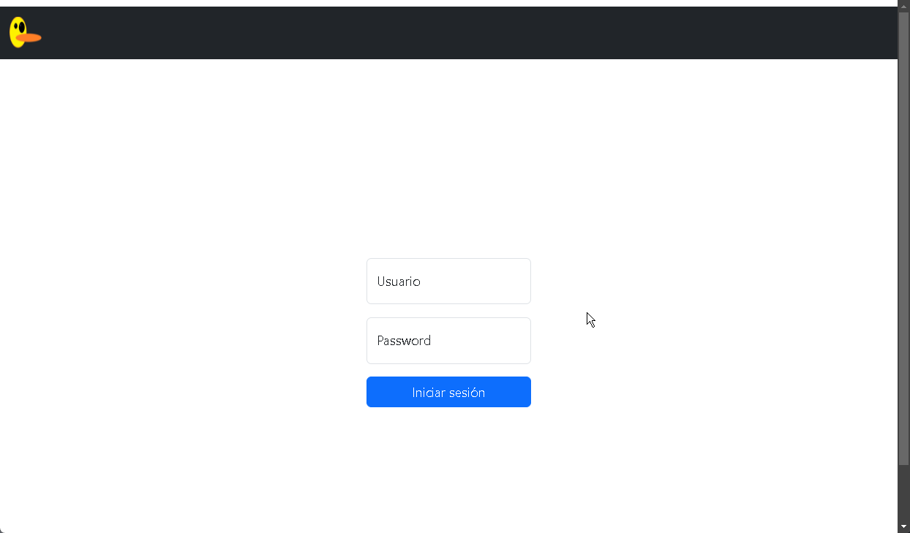

# Patito-Frontend

La pagina esta hecha con react

Se implemento un login: 

En el cual se genera el token para las demas llamadas al ser confirmado como exitoso:

Una vez logeado se muestra la siguiente ventana:

En ella podemos a preciar opciones en el menu las cuales son:
    - Registro ordenes
        - En esta ventana se podra crear ordenes
    - Listar ordenes
        - En esta se podra listar las ordenes existentes
    - Salir
        - Se genera un logout

La ventana de registro de ordenes se visualiza asi:

En ella al dar clic en el cuadro de Seleccionar cliente nos abrira el siguiente modal:

Se puede buscar por nombre, apellido, telefono o email:

Podemos registrar a nuevos clientes

Al obtener el listado de clientes, al dar en el boton Selecionar nos permitira marcar al cliente

Al dar clic en el cuadro de Seleccionar tienda nos abrira el siguiente modal:

Se nos mostrara las tiendas disponibles, al dar en el boton Selecionar nos permitira marcar la tienda

El cuadro de vendor es una caja de texto, por lo cual solo se podra capturar el nombre del vendedor.

El boton de Agregar producto, nos abrira la siguiente modal:

Al escribir se realizara una busqueda de los articulos exitentes: 

Al seleccionar un articulo se nos desplegara la opcion de definir cuanta cantidad deseamos agregar y si deseamos agregar descuento:

En el caso que no se cuente con stock suficiente se ocultara el boton de seleccionar

Al seleccionar los productos podemos generar el pedido, se nos pedira una confirmacion:

Se creara la orden:

En el menu de Listar ordenes, se mostrara el listado de todas las ordenes creadas:

Al dar clic en ver Detalles podemos ver los detalles de la orden al final de la pagina:

Podemos entregar la orden con el boton entregar:

Con ello se cambiara el estado de la orden

Al entregar o cancelar se ocultan los botones de entregar y cancelar

En el caso de cancelar y que se haya superado el tiempo de 10 min despues de su creacion se mandara el siguiente mensaje:

En el caso de estar en tiempo permitira cancelar la orden:

